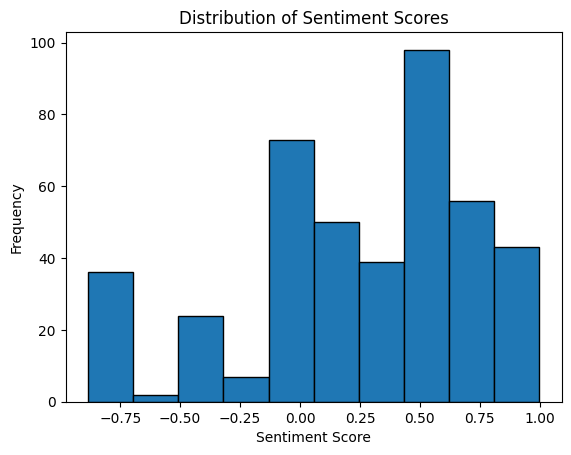
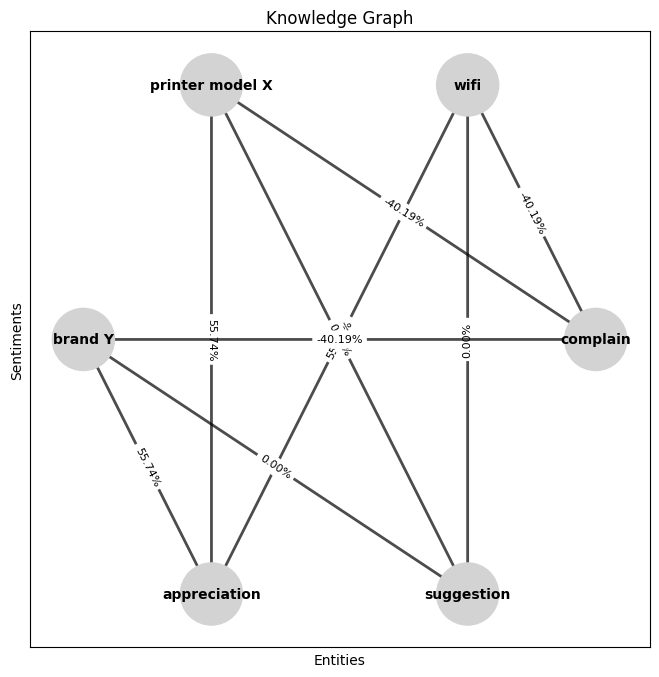

# Project: Knowledge Graph of HP India Products using Social Media Posts

## Introduction
This project aims to create a knowledge graph of HP India Products using social media posts. The goal is to understand customer sentiments, feedback, and experiences related to HP India Products by crawling social media platforms. The solution will involve data scraping, data preprocessing, sentiment analysis, and knowledge graph creation. The knowledge graph will enable stakeholders to query and retrieve information about specific printer models, brands, features, problems, and sentiments.

## Prerequisites
Before running the code, ensure you have the following:

1. Python: Install Python on your system.
2. Libraries: Install the required libraries, including `nltk`, `pandas`, `requests`, and `networkx`.
3. API Access: Obtain access to the social media API to retrieve relevant posts and data.

## Setup
1. Clone the project repository from the GitHub repository.
2. Set up the necessary libraries and dependencies by installing them using pip or any package manager of your choice.
3. Replace the placeholder values in the code with your API access credentials and other relevant details.

## Usage
1. Open the project in notebook or Google colab.
2. Navigate to the directory containing the code files.
3. Run the file `Main.ipynb` to initiate the data scraping process from the social media API.
4. The file will automatic retrieve social media posts related to HP India Products and store them in a structured format.
5. After data scraping, preprocessing of the scraped data will start.
6. The preprocessing step will clean the text by removing links, hashtags, and symbols from the reviews.
7. Execute the sentiment analysis code afterwards to analyze the sentiments of the preprocessed data using the NLTK sentiment analysis model.
8. The sentiment analysis will classify the posts into categories such as complaint, suggestion, or appreciation.
9. Finally, run the code of knowledge graph to create a knowledge graph using the analyzed data.
10. The knowledge graph will enable stakeholders to query and retrieve information based on specific criteria, such as printer model, brand, features, problems, or sentiments.

## Knowledge Graph Queries
Once the knowledge graph is created, stakeholders can make queries to gain insights and facilitate decision-making. Some example queries include:

1. List all posts discussing Wi-Fi issues in printer model X or brand Y.
2. Retrieve all posts expressing appreciation for a specific printer model or brand.
3. Identify common complaints or suggestions related to printer features or functionality.
4. Find posts discussing a specific problem with printer ink cartridges.
5. Analyze sentiments over time for a particular printer model or brand.

Feel free to modify the code and adapt it to your specific requirements and data sources. The knowledge graph serves as a valuable tool for understanding customer sentiments, improving products, and enhancing customer service.

## ScreenShot of the data analysis graph and knowledge graph

## Conclusion
By leveraging social media data, sentiment analysis, and knowledge graph creation, this project enables the creation of a knowledge store for HP India Products. It empowers HP to understand customer sentiments, address issues promptly, and enhance brand value and customer satisfaction. The knowledge graph provides a powerful tool for stakeholders to access and query relevant information, enabling better decision-making and improved product development.

Enjoy working with the knowledge graph and gaining valuable insights from social media data related to HP India Products!
